# Quick Start

Before you can use **EasyML Studio**, you must configure the environment which include your ***development environment*** and ***runtime server environment*** which contains *Preparation, Run Docker containers and Start services* three steps to run it successfully.

## Development Environment For IDEA
### Step 1: Import project to IDEA 

- Get code from Git repository <https://github.com/ICT-BDA/EasyML>
- Import the code to your IDE via maven project 

<div align=center>
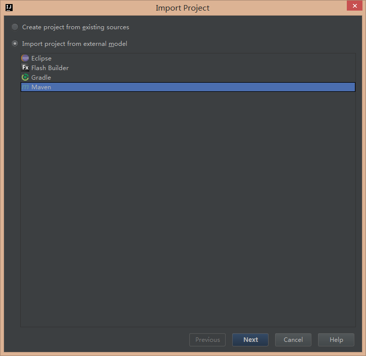
</div>

- Support **java version 1.7** by default

<div align=center>
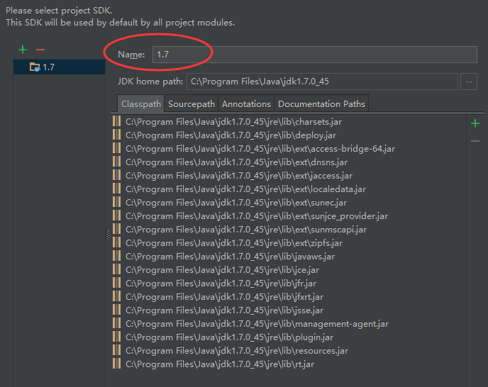
</div>

  
### Step 2: Configure GWT Lib Path

* Make sure your IDE have install ***Maven*** and ***GWT*** plugin
* Please remove or comment `jdk.tools` dependency properties in pom.xml(This dependency is not used for IDEA, but for eclipse IDE) 

<div align=center>
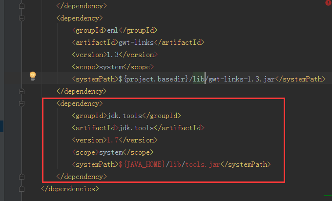
</div>

* Use Maven clean and compile goal to download all related dependency package
<div align=center>
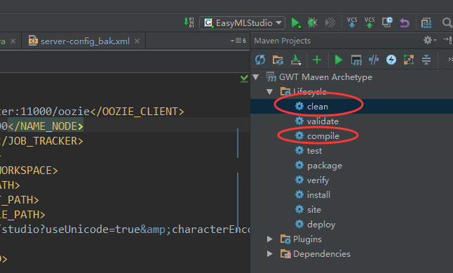
</div>

* Make sure you can see the whole **External Libraries** on the *Project* list
<div align=center>
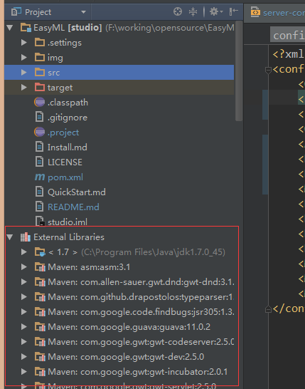
</div>

* Use `gwt:compile` plugin to compile gwt project.
<div align=center>
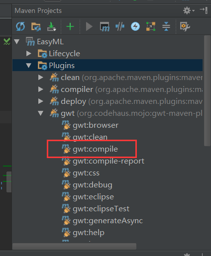
</div>

### Step 3: Create and run our EML web application
  After you have get all dependencies and finish all compilation, you can start building your *EasyML Studio* web app for the following steps:

* Edit run configurations

<div align=center>
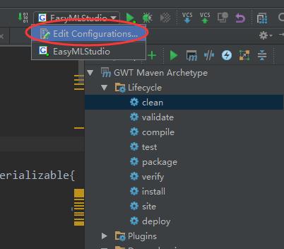
</div>

* Add GWT web app via `+` at upper left corner, if you do not see `GWT Configuration` in the list, you might have something wrong in the step of *Configure GWT Lib Path*. Go back to the last step, resolve the problem.

<div align=center>
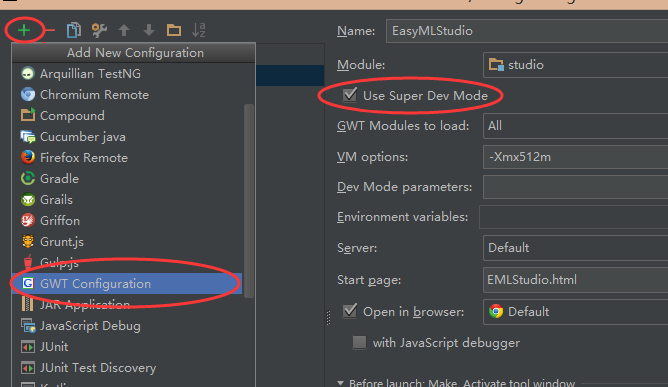
</div>

* `Use Super Dev Mode` can allow you debugging your web app at the browser side. It is make debugging more effient, for which remember choosing it. 
* When you have finished all the steps above, you can click the green run button to make and debug the **EasyML**. After a while, you can browse EasyML in your *Chrome* to access it.
<div align=center>
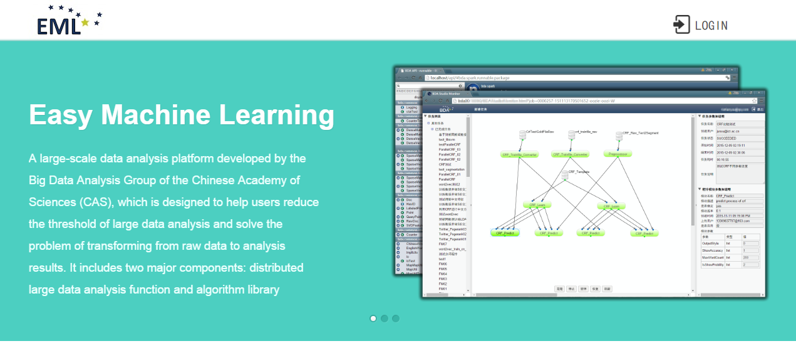
</div>

## Development Environment For Eclipse

### Step 1: Import project to Eclipse

* Make sure your eclipse have install **maven** and **GWT** plugins.(As the GWT plugins can't be downloaded easily now, we supply [GWT plugins for Eclipse 4.4 Luna](https://pan.baidu.com/s/1hrFSyI4), you can install the plugin to eclipse by offline mode) 

* Import the code into your IDE via maven project
<div align=center>
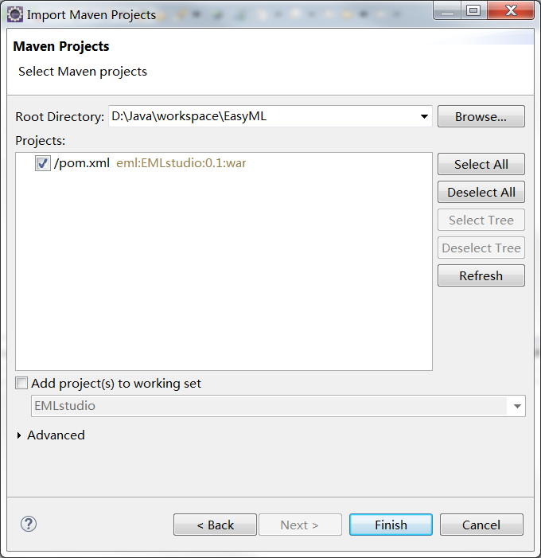
</div>

* Click project peoperties by right key to modify project facets. Keep these facets as bellows will make your project structure more clearly.
<div align=center>
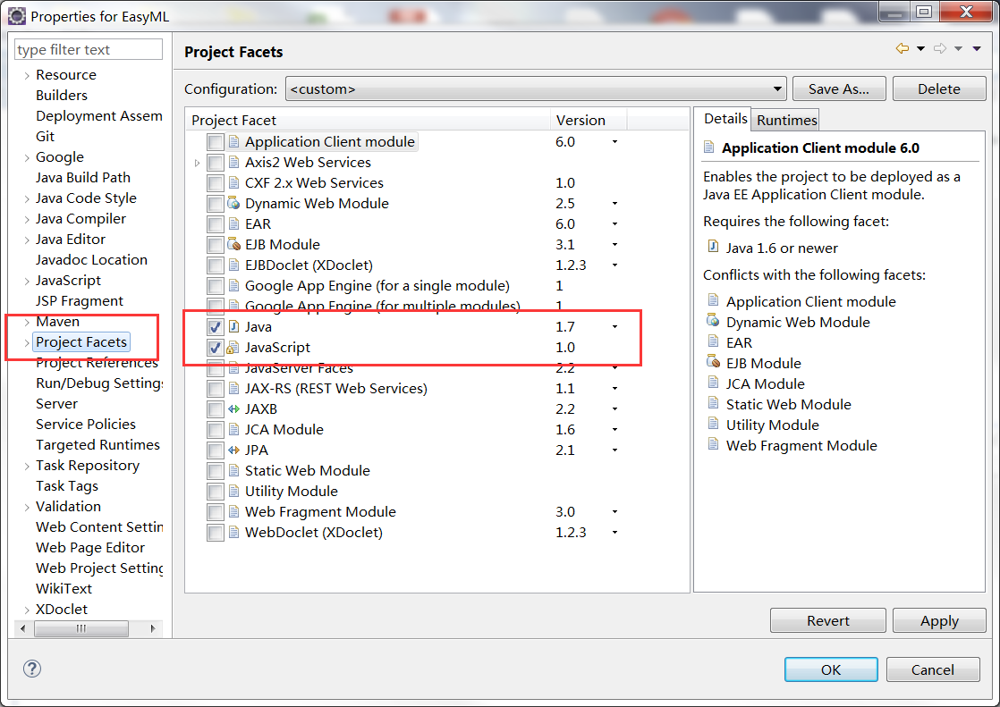
</div>

* The project support **java version 1.7** by default, you can switch to other java version by project configuration modification.

### Step 2: Compile GWT Project

* Use maven clean and maven compile goal to download all related dependency package. Right click project `Run as`, select `maven clean` to clean the project and then select `maven build...` to configure goal for project compiling.
<div align=center>
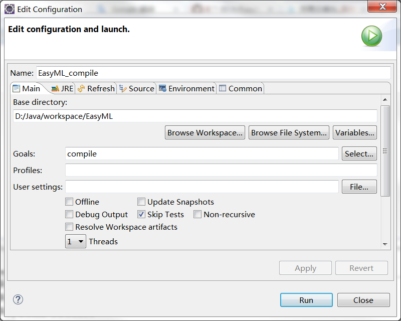
</div>

* If you meet **tools.jar can not be found error**, you should modify your project JRE System Library from JRE to JDK path. The eclipse import project use JRE path by default.
<div align=center>
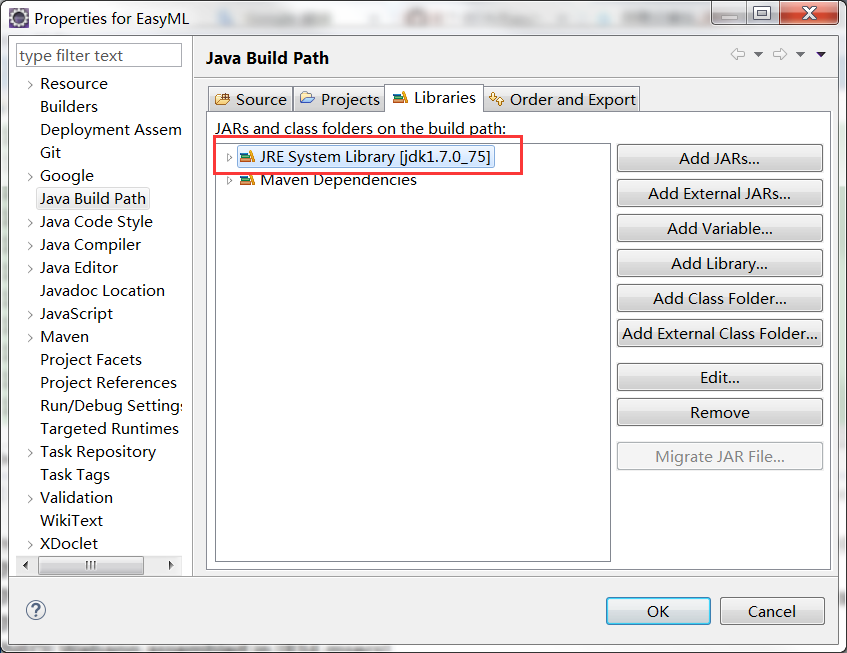
</div>

* When you finish compiling the project, please refresh it.

* Use gwt-maven plugin goal to compile the gwt project. If you don't do this step, you can't see some images in your browser when you login the system.
<div align=center>
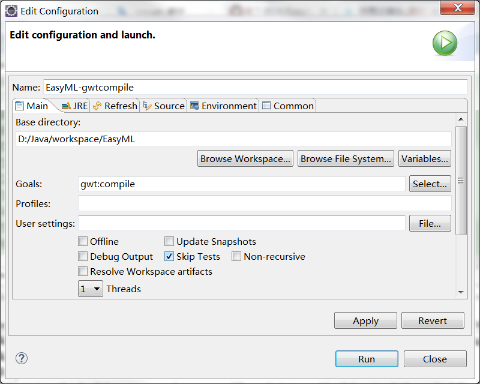
</div>

### Step 3: Run our EML web application

* Right click the project `Run as`, select `Web Application(GWT Super Dev Mode)`. Then select `index.html` page to run the project.

<div align=center>
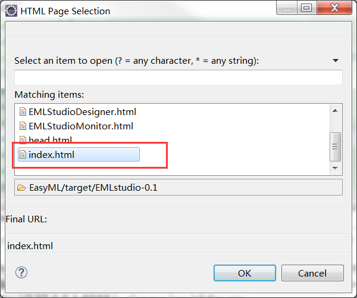
</div>

* After a while for above steps, you can see the finished `Console` state.
<div align=center>
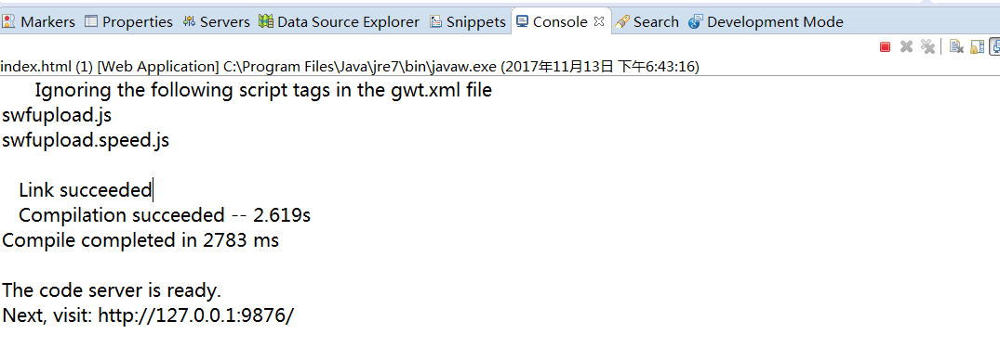
</div>

* Switch to the `Development Mode`, and you can visit the project through the url.
<div align=center>
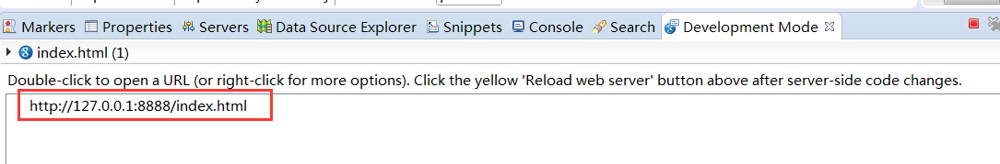
</div>

## Preparation for virtual server cluster
Our server cluster is based on ***Docker***, thus you can build run time environment on your own computer. It is convenient for you to develop project without any remote connections. Furthermore, you can also contribute to the server environments. The docker version server cluster is not stable and efficient, for which we can do a series of things on it. However, you first step to access it is installing Docker.
### Step 1: Install Docker 
* Just follow the [official guide](https://www.docker.com/) to install Docker. If you install the `docker in windows`, at least `Minimum Memory Requirement (RAM) = 8GB` for standalone computer. Hard drive must contain `enough space (10GB)` in which you install Docker. Otherwise it will be very very slow.
* Make sure your docker service runs correctly via `Docker info` and `Docker version`
* No matter which system your computer is, stop the **Firewall** of your system
* If you are using *centos 7*, you also should stop the **selinux**, in order to avoiding run Docker container error. 
* Run ```sudo docker run hello-world``` to see if we have install docker successfully.


### Step 2: Pull mysql server images from docker hub
* Pull our mysql server images from our [docker hub](https://hub.docker.com/u/nkxujun/):


    ```docker pull nkxujun/mysql_eml:version (latest default)```
### Step 3: Pull ubuntu_eml images from docker hub
* Our Eml server images is based on ubuntu, so pull it first:   


    ```docker pull nkxujun/ubuntu_eml:version(latest default)```
* You can use `docker images` to see if you have pulled these two images successfully:

	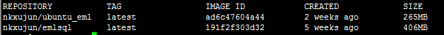
 
### Step 4: Download install dependent package
Every single server in our cluster is created by one *docker image*, and this *image* can be built via a **Dockerfile** which has defined by us and includes all utilities we need such as hadoop. Thus we need to download the **Dockerfile** and all dependent files and configuration files from our [google drive disk](https://drive.google.com/open?id=0B5Lj6qkCMBbFWW5uYlJwb2drb1k) or [Baidu Cloud](https://pan.baidu.com/s/1bpMwYSJ).


### Step 5: Build Eml server images  
* Enter the path of the files which you have download last step
* Use build.sh to build our image, this process will last for a few minute  
     ```sh build.sh``` 
* You can use `docker images` to see if you have built successfully:

	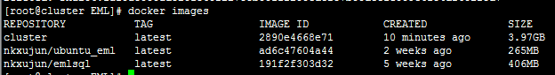

## Run docker virtual server cluster
### Build a network for docker virtual server cluster
* Use `sh build_network.sh` to build a network which called **shadownet**:

	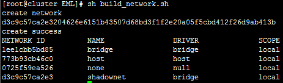
### Run all needed containers

* You can use `sh run_containers.sh` to run all servers:

	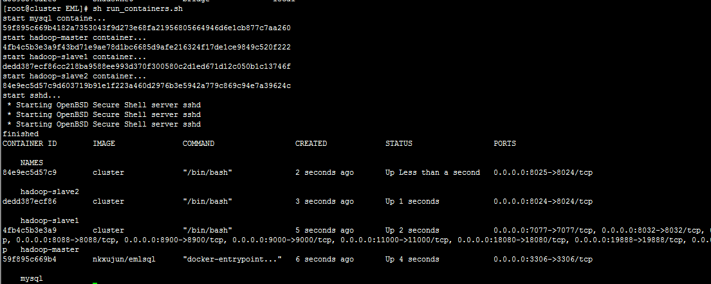

* If your have run all these four server successed: **mysql, hadoop-master, hadoop-slave1,hadoop-slave2**, you can use `docker ps` to check

### Confirm the connectivity between containers
Because the hadoop cluster network communication depend on ssh, we need to confirm that the three server can do ssh log-in without password.

* We can use `docker exec -it hadoop-master /bin/bash` to enter the container named *Hadoop-master*
* In *Hadoop-master*，use `ssh localhost`、`ssh hadoop-slave1` and `ssh hadoop-slave2` to test the ssh function and do not forget *exit* after each ssh test, check all the hadoop containers ssh service is working:

	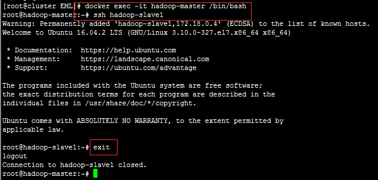

* If the ssh does not work, enter each container and execute this:
	```/etc/init.d/ssh start``` 
* If you meet **Bad owner or permissions on ~/.ssh/config.** exception when you test `ssh localhost`, you can execute `chmod 600 ~/.ssh/config` command and try again.

## Start all services in cluster 

### Configure local hosts 
  * Add your Localhost(Linux) or Docker IP(Windows, if you use [DockerToolBox](https://www.docker.com/products/docker-toolbox "DockerToolBox") to install, the default virtual IP is `192.168.99.100`) as `hadoop-master` , `hadoop-slave1`, `hadoop-slave2` and `mysql` to your hosts file, for example:
 
>      10.20.11.7 hadoop-master
>      10.20.11.7 mysql
>      10.20.11.7 hadoop-slave1
>      10.20.11.7 hadoop-slave2

### Init Mysql database
 * Run `sh init_mysql.sh` to prepare the databases for *Oozie* and *EasyML Studio* 
### Add Tensorflow Support
Our EML installation package in version 1.2.0 or above could support Tensorflow mode.Follow the steps bellow If you want to have a try.

 * Enter the `hadoop-master` container via  docker exec -it hadoop-master /bin/bash 
 * Run `sh /root/config-tensorflow.sh` to config the environment that tensorflow need.
 * If you want to config the environment yourself, you can do use the  tensorflow folder scripts in EasyML Project.
### Start HDFS，spark and Yarn service
 * Enter the *hadoop-master* container via `docker exec -it hadoop-master /bin/bash` (a vital important command to enter every container)
 * Run `sh /root/start-hadoop.sh` to start hadoop and spark service
 * You can use `sh /root/run-wordcount.sh` to test the hadoop service
 * Visit *http://hadoop-master:50070/* in your browser to check namenode and every datanode's status:  
<div align=center>
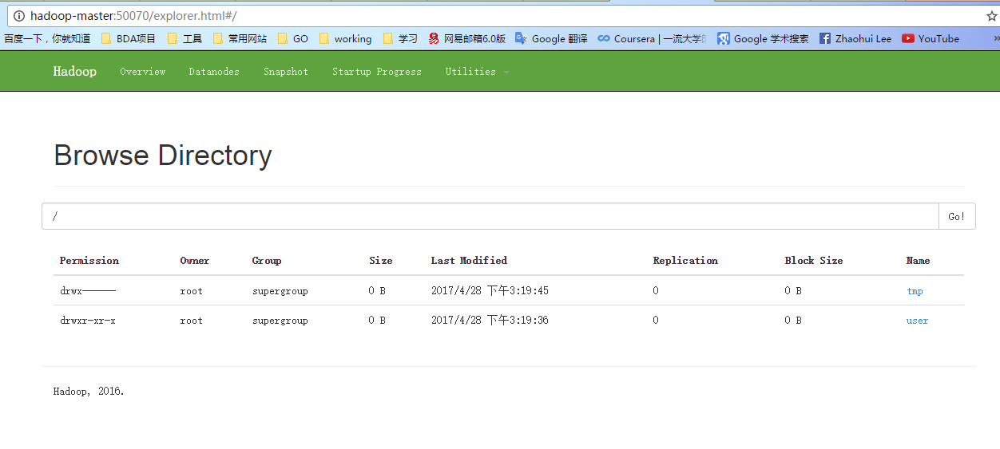
</div>

### Start Oozie service
 * Enter the *hadoop-master* container via `docker exec -it hadoop-master /bin/bash` 
 * Run `sh /root/start-oozie.sh` to start Oozie and Tomcat service, it will spend some time:
<div align=center>
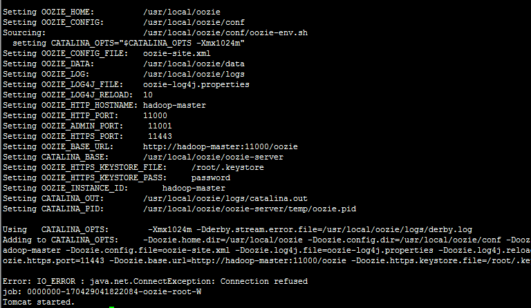
</div>

 * We have started an ooize task example in the start shell, you can visit *http://hadoop-master:11000/oozie/* in your browser and refresh for the detail of the task.
<div align=center>
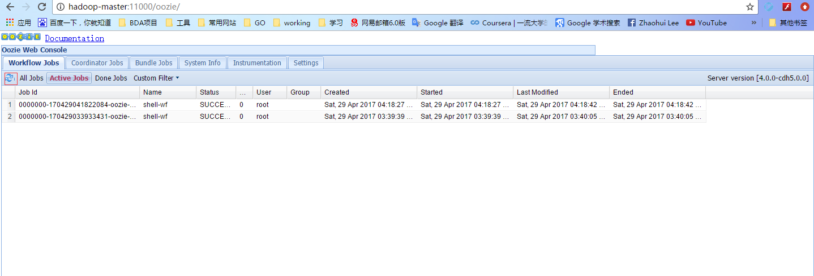
</div>
 * when you finish install oozie, you can't visit http://hadoop-master:11000/oozie/  and when you execute oozie status check by below  command in hadoop-master container, it appear connection exception:
 
>      oozie admin -oozie http://hadoop-master:11000/oozie -status
>      //Meet below exception
>      Error: IO_ERROR:java.net.ConnectException: Connection refused
  then you can try to restart oozie again in hadoop-master container like belows:

>     rm -rf $OOZIE_HOME/logs/*    //Clear log directory
>     rm -rf $OOZIE_HOME/oozie-server/logs/*    //Clear log directory
>     rm -rf $OOZIE_HOME/oozie-server/temp/*    //Clear temp directory
>     rm -rf $OOZIE_HOME/oozie-server/webapps/oozie/     //Delete oozie 
>     rm -rf $OOZIE_HOME/oozie-server/webapps/oozie.war    //Delete oozie.war
>     ./root/start-oozie.sh    //Rerun the start script about oozie


### Visit EMLStudio test website to confirm correctness of whole process
* Visit *http://hadoop-master:18080/EMLStudio* in your browser and log in via *username: `bdaict@hotmail.com`* and *password: `bdaict`*, you can find a example in the task list.
* Clone it and submit to the server. If the task can run correctly, congratulations on your successful configuration. 
<div align=center>
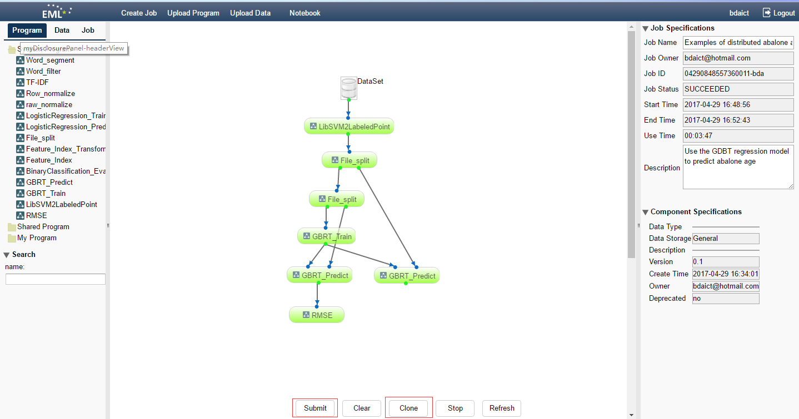
</div>

### Stop and restart containers
* If you want to rebuild the cluster, you can use `sh stop_containers.sh` to stop and remove *hadoop-master, hadoop-slave1 and hadoop-slave2* containers and use `sh rm_images.sh` to remove *cluster* image.
* If you have restart your docker or entity machine, the containers need to be restarted, you can use `sh restart_service.sh` to restart all containers. But you need to note that after you have executed the `sh restart_service.sh`, you will enter the *hadoop-master* container, meanwhile you also need to execute the `sh restart.sh` in *hadoop-master* container to restart *hadoop, spark and oozie* service.


