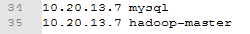

# Quick Start

Before you can use *EasyML Studio*, you must configure the environment which include runtime servers environment and your development environment.

## Development Environment
### Import project to IDEA or Eclipse 

- Get code from Git repository <https://github.com/ICT-BDA/EasyML>
- Import the code to your IDE via maven project 

<div align=center>

</div>
- Only support **java version 1.7**

<div align=center>

</div>

  
### Configure GWT Lib Path
* Make sure your IDE have install ***Maven***
* Use Maven to down load all related dependency package
<div align=center>

</div>
* Make sure you can see the whole **External Libraries** on the right
<div align=center>

</div>
* Install GWT plugin in your IDE (IDEA user can skip this step)
### Create and run our EML web application
  After you have get all dependencies, you can start building your *EasyML Studio* web app for the following steps:

* Edit run configurations

<div align=center>

</div>
* Add GWT web app via `+` at upper left corner, if you do not see `GWT Configuration` in the list, you might have something wrong in the step of *Configure GWT Lib Path*. Go back to the last step, resolve the problem.

<div align=center>

</div>
* `Use Super Dev Mode` can allow you debugging your web app at the browser side. It is make debugging more effient, for which remember choosing it. 
* When you have finished all the steps above, you can click the green run button to make and debug the **EasyML**. After a while, you can browse EasyML in your *Chrome* to accesss it.
<div align=center>

</div>

## Preparation for virtual server cluster
Our server cluster is based on docker, thus you can build it on your own computer. It is convenient for you to develop project without any remote connections. Furthermore, you can also contribute to the server environments. The docker version server cluster is not stable and efficient, for which we can do a series of things on it. However, you first step to access it is installing Docker.
### Install Docker 
* Just follow the [official guide](https://www.docker.com/) to install Docker.
* Make sure your docker service runs correctly via `Docker info` and `Docker version`
* No matter which system your computer is, stop the **Firewall** of your system
* If you are using *centos 7*, you also should stop the **selinux**, in order to avoiding run Docker container error. 
* Run ```sudo docker run helloworld``` to see if we have install docker successfully.


### Pull mysql server images from docker hub
* Pull our mysql server images from our [docker hub](https://hub.docker.com/u/nkxujun/):
    ```docker pull nkxujun/emlsql```
### Pull ubuntu_eml images from docker hub
* Our Eml server images is based on ubuntu, so pull it first:   
    ```docker pull nkxujun/ubuntu_eml```
* You can use `docker images` to see if you have pulled these two images successfully:
	

 
### Down load install dependent package
Every single server in our cluster is created by one *docker image*, and this *image* can be built via a **Dockerfile** which has defined by us and includes all utilities we need such as hadoop. Thus we need to download the **Dockerfile** and all dependent files and configuration files from our [google drive disk](https://drive.google.com/open?id=0B5Lj6qkCMBbFWW5uYlJwb2drb1k).


### Build Eml server images  
* Enter the path of the files which you have download last step
* Use build.sh to build our image, this process will last for a few minute  
     ```sh build.sh``` 
* You can use `docker images` to see if you have built successfully:
	

## Run docker virtual server cluster
### Build a network for docker virtual server cluster
* Use `sh build_network.sh` to build a network which called **shadownet**:
	
### Run all needed containers

* You can use `sh run_containers.sh` to run all servers:
	
* If your have run all these four server successed: **mysql, hadoop-master, hadoop-slave1,hadoop-slave2**, you can use `docker ps` to check

### Confirm the connectivity between containers
Because the hadoop cluster network communication depend on ssh, we need to confirm that the three server can do ssh log-in without password.

* We can use `docker exec -it hadoop-master /bin/bash` to enter the container named *Hadoop-master*
* In *Hadoop-master*，use `ssh hadoop-slave1` and `ssh hadoop-slave2` to test the ssh function and do not forget *exit* after each ssh test:
	
* If the ssh does not work, enter each container and execute this:
	```/etc/init.d/ssh start``` 

## Start all services in cluster 

### Configure local hosts 
  * Add your Localhost(Linux) or Docker IP(Windows) as `hadoop-master` and `mysql` to your hosts file, for example:
 
    
### Init Mysql database
 * Run `sh init_mysql.sh` to prepare the databases for *oozie* and * * 
### Start HDFS and Yarn service
 * Enter the *hadoop-master* container via `docker exec -it hadoop-master /bin/bash` (a vital important command to enter every container)
 * Run `sh /root/start-hadoop.sh` to start hadoop service
 * You can use `sh /root/run_wordcount.sh` to test the hadoop service
 * Visit *http://hadoop-master:50070/* in your browser to check namenode and every datanode's status:  
<div align=center>

</div>
### Start Spark and Oozie service
 * Enter the *hadoop-master* container via `docker exec -it hadoop-master /bin/bash` 
 * Run `sh /root/start-oozie.sh` to start Spark, Oozie and Tomcat service, it will spend some time:
<div align=center>

</div>
 * We have started a ooize task example in the start shell, you can visit *http://hadoop-master:11000/oozie/* in your browser and refresh for the detail of the task.
<div align=center>

</div>
### Visit EMLStudio test website to confirm correctness of whole process
* Visit *http://hadoop-master:18080/EMLStudio* in your browser and log in via *username: bdaict@hotmail.com* and *password: bdaict*, you can find a example in the task list.
* Clone it and submit to the server. If the task can run correctly, congratulations on your successful configuration. 
<div align=center>

</div>

### Stop and restart containers
* If you want to rebuild the cluster, you can use `sh stop_containers.sh` to stop and remove *hadoop-master, hadoop-slave1 and hadoop-slave2* containers and use `sh rm_images.sh` to remove *cluster* image.
* If you have restart your docker or entity machine, the containers need to be restarted, you can use `sh restart_service.sh` to restart all containers. But you need to note that after you have executed the `sh restart_service.sh`, you will enter the *hadoop-master* container, meanwhile you also need to execute the `sh restart.sh` in *hadoop-master* container to restart *hadoop, spark and oozie service.


