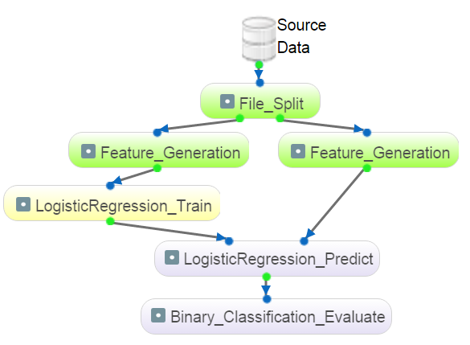
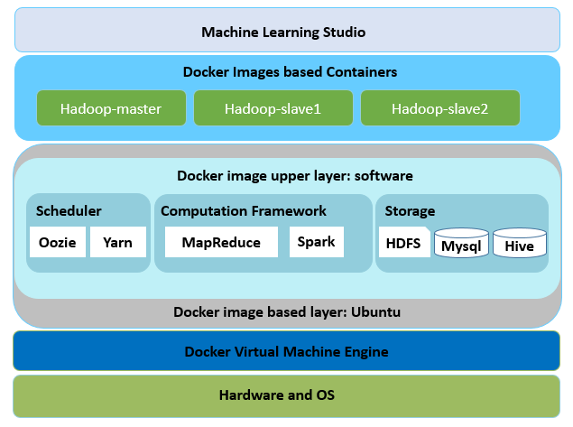
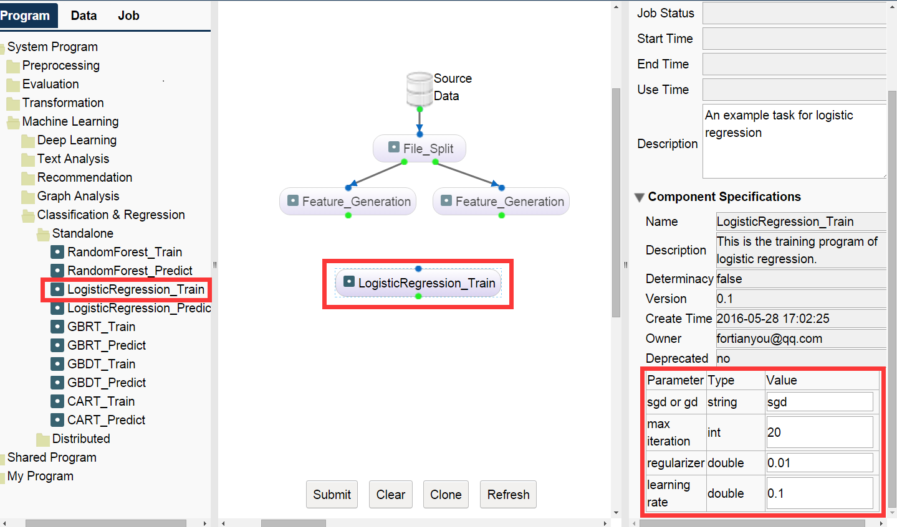
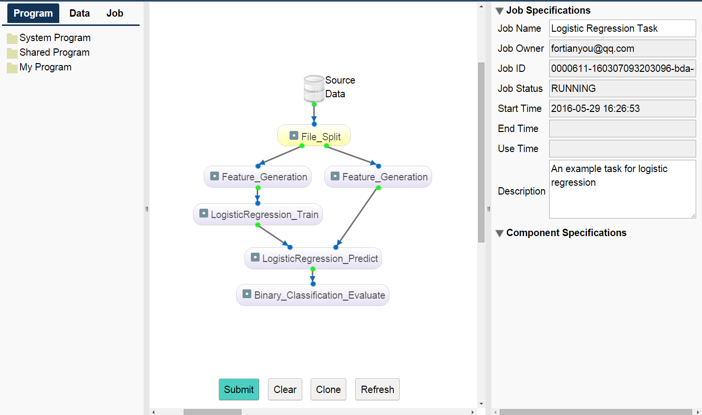
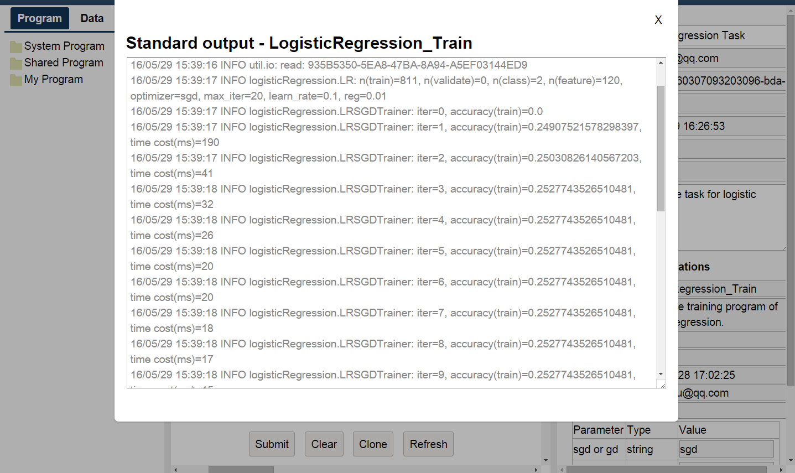
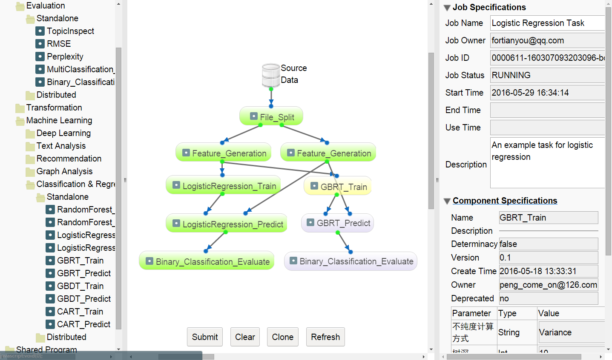
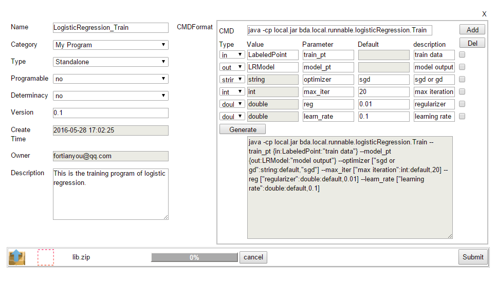

# Easy Machine Learning

## What is Easy Machine Learning
Machine learning algorithms have become the key components in many big data applications. However, the full potential of machine learning is still far from been realized because using machine learning algorithms is hard,
especially on distributed platforms such as Hadoop and Spark. The key barriers come from not only the implementation of the algorithms themselves, but also the processing for applying them to real applications which often involve multiple steps 
and different algorithms. 

Our platform **Easy Machine Learning** presents a general-purpose dataflow-based system for easing the process of applying machine learning algorithms to real world tasks. In the system a learning task is formulated as a directed acyclic graph (DAG) in which each node represents an operation 
(e.g. a machine learning algorithm), and each edge represents the flow of the data from one node to its descendants. The task can be defined manually or be cloned from existing tasks/templates. After submitting a task to the cloud, each node will be automatically scheduled to execute according to the DAG. 
Graphical user interface is implemented for making users to create, configure, submit, and monitor a task in a drag-and-drop manner. Advantages of the system include 
 
1. Lowing the barriers of defining and executing machine learning tasks;
 
2. Sharing and re-using the implementations of the algorithms, the job DAGs, and the experimental results;

3. Seamlessly integrating the stand-alone algorithms as well as the distributed algorithms in one task.

The system consists of three major components: 

* A distributed machine learning library which implements not only popular used machine learning algorithms, but also the algorithms for data pre/post-processing, data format transformation, feature generation, performance evaluation etc. These algorithms are mainly implemented based on Spark.  
* A GUI-based machine learning studio system which enable users to create, configure, submit, monitor, and sharing their machine learning process in a drag-and-drop manner. All of the algorithms in the machine learning library can be accessed and configured in the studio system. They are the key building blocks for constructing machine learning tasks. 

* A cloud service for executing the tasks. We build the service based on the open source big data platform of Hadoop and Spark. In order to build an platform, we organised a cluster of server on ***Docker***. After receiving a task DAG from the GUI, each node will be automatically scheduled to run when all of its dependent data sources are ready. The algorithm corresponds to the node will scheduled to run on Linux, Spark, or Map-Reduce, according to their implementation.

## How to involve in our project

Pull all project and prepare some necessary environments and a kind of development utilities. Follows the step in **[Quick-start.md](https://github.com/ICT-BDA/EasyML/blob/master/QuickStart.md)**, and you can create our system in your computer.

## How to use Easy Machine Learning Studio 
After you have ran Easy ML，You can login via `http://localhost:18080/EMLStudio.html`with our official account `bdaict@hotmail.com` and password `bdaict`. For the best user experience, it is recommended to use Chrome.

* As shown in the following figure, the users can create a machine learning task (a dataflow DAG) with the algorithms and data sets listed in the left panel of the page. They can choose to click the algorithms and data sets listed in the **`Program`** and **`Data`** panels. They can also click the **`Job`** panel, select an existing task, clone it, and make necessary modifications. The users can configure the task information and parameter values of each node in the right panel. The nodes in the task could corresponds to either a stand-alone Linux program or a distributed program running on Spark or Hadoop Map-Reduce.

* The task is submitted to run on the cloud after clicking the **`submit`** button. The status of each node is indicated with different colors, as shown in the following figure.

* Users could right click on the **`green output port`** of finished executing node to preview the output data. One could check the stdout and stderr logs from the right click menu of each finished executing node as well.
The users may check the outputs of a node by right clicking the corresponding output ports. The standard output and standard error information printed during the execution can be checked through right clicking the corresponding nodes and selects the menu **`Show STDOUT`** and **`Show STDERR`**.

* A finished (either success or not) task can be further modified and resubmitted to run, as shown in the following figure. Our system will only schedule the influenced nodes to run. The outputs of uninfluenced nodes are directly reused to save the running time and system resources.

* The users can upload their own algorithm packages and data sets for creating their own tasks or shared with other users. By clicking the **`upload program`** button, the popup window allows the users to specify the necessary information of the algorithm package, including the name, the category, the description, and the command line pattern string etc, as shown in the following figure. The most important thing is to write the command line pattern string with the predefined format. It defined the input ports, output ports, and parameter settings of a node. We developed a tool in the panel for helping users to write the command line string patterns. By clicking the **`upload data`** button, users can upload a data set in the similar way as that of uploading a algorithms package.

## How to experience our system
We apply an online service for you to experience our system. You can register your own account or use our official account to login the system. The website of the system is as belows:

* Outside ICT, you can visit: [http://159.226.40.104:18080/dev/](http://159.226.40.104:18080/dev/ "http://159.226.40.104:18080/dev/")
* Inside ICT, you can visit: [http://10.60.0.50:18080/dev/](http://10.60.0.50:18080/dev/ "http://10.60.0.50:18080/dev/")

If you have any advice or problems when you expericen our system, welcome to contact us! You can leave us a message or give a email to `bdaict@hotmail.com`, thank you for your advice!

## Papers and Presentations 
1. [EasyML: Ease the Process of Machine Learning with Data Flow.](http://www.bigdatalab.ac.cn/~junxu/publications/SOSP2017-AISys-EasyML.pdf) SOSP AI System Workshop Shanghai Oct. 28, 2017 
2. Tianyou Guo, Jun Xu, Xiaohui Yan, Jianpeng Hou, Ping Li, Zhaohui Li, Jiafeng Guo, and Xueqi Cheng. [Ease the Process of Machine Learning with Dataflow.](http://www.bigdatalab.ac.cn/~junxu/publications/CIKM2016_BDADemo.pdf) Proceedings of the 25th ACM International Conference on Information and Knowledge Management (CIKM '16), Indianapolis, USA, pp. 2437-2440, 2016.

## Acknowledgements
The following people contributed to the development of the EasyML project：

* **Jun Xu**, Institute of Computing Technolgy, Chinese Academy of Sciences. Homepage: [http://www.bigdatalab.ac.cn/~junxu](http://www.bigdatalab.ac.cn/~junxu)
* **Xiaohui Yan**, Homepage: [http://xiaohuiyan.github.io/](http://xiaohuiyan.github.io/) 
* **Xinjie Chen**,  Institute of Computing Technolgy, Chinese Academy of Sciences
* **Zhaohui Li**,  Institute of Computing Technolgy, Chinese Academy of Sciences
* **Tianyou Guo**,  Sougou Inc
* **Jianpeng Hou**,  Google China
* **Ping Li**,  Tencent Wechat
* **Jiashuo Cao**, Chengdu University of Information Technology
* **Dong Huang**, University of Chinese Academy of Sciences
* **Xueqi Cheng**, Institute of Computing Technolgy, Chinese Academy of Sciences. Homepage: [http://www.bigdatalab.ac.cn/~cxq/](http://www.bigdatalab.ac.cn/~cxq/)

